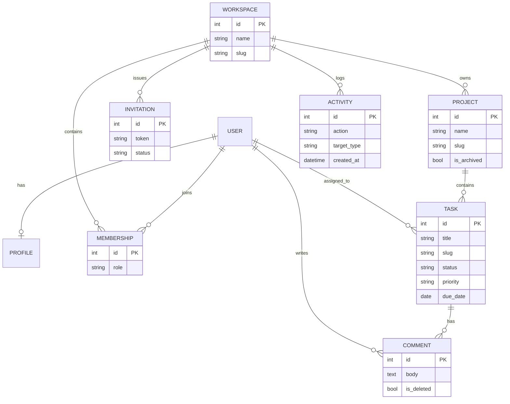
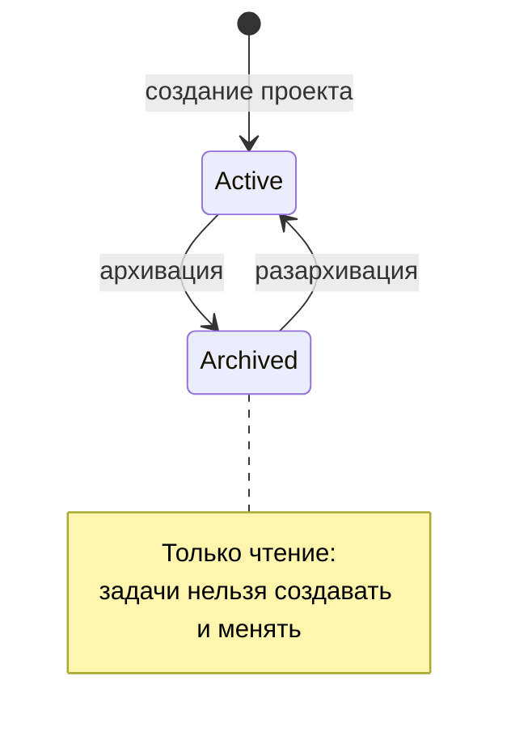
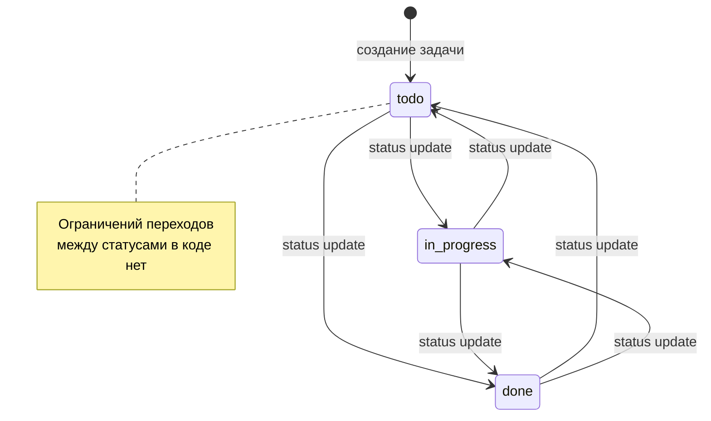
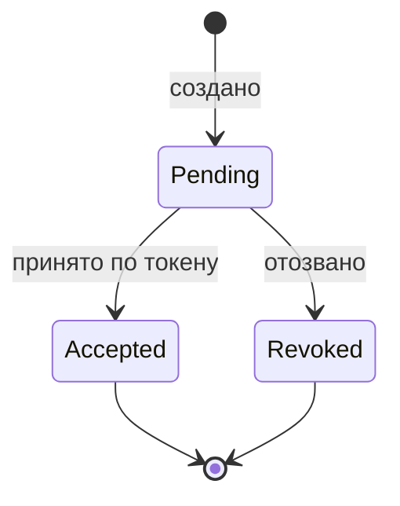
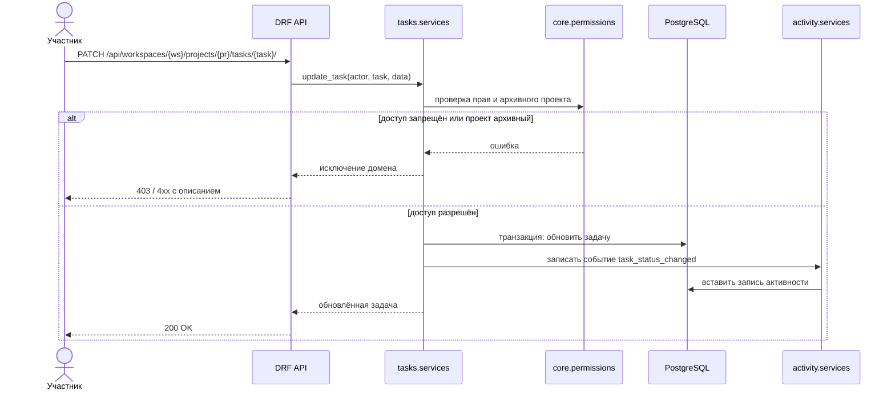

# Кейс 1. Team Task Manager: ретроспективный системный анализ

**Тип:** реальный pet/commercial-style backend-проект автора  
**Репозиторий проекта:** [f1sherFM/Team_Task_Manager](https://github.com/f1sherFM/Team_Task_Manager)  
**Что сделано:** по готовому коду и README описана система так, как это делал бы системный аналитик на этапе проектирования: роли, требования, модели, контракты, тесты.

> **Важно.** Документ составлен ретроспективно по README проекта. Всё, что README не подтверждает напрямую (точные права ролей, список статусов, поля моделей), помечено как **Допущение** и должно быть сверено с кодом. Список в конце документа.

---

## 1. Контекст

Team Task Manager (TTM) — backend-first SaaS для командной работы: рабочие пространства (workspaces), проекты, задачи, комментарии и журнал активности. Есть серверно-рендеримый HTML-интерфейс и REST API с JWT-аутентификацией и Swagger/OpenAPI.

**Бизнес-цель (формулировка аналитика):** дать небольшим командам единое место для постановки задач и прозрачной истории изменений, где доступ ограничен рамками рабочего пространства.

**Границы системы**

| В границах | Вне границ |
|---|---|
| Workspaces, участники, приглашения, роли | Внешние мессенджеры и почта как каналы уведомлений |
| Проекты, архивация проектов | Тайм-трекинг, биллинг |
| Задачи, назначение, статусы, приоритеты, сроки | Диаграммы Ганта, спринты |
| Комментарии (мягкое удаление) | Файловые вложения |
| Журнал активности (append-only) | Сложная аналитика и отчёты |

## 2. Стейкхолдеры и роли

| Роль | Описание |
|---|---|
| `owner` | Владелец рабочего пространства; единственный, кто может передать владение |
| `admin` | Управляет участниками и проектами |
| `member` | Работает с задачами и комментариями |
| Приглашённый | Пользователь, получивший токен-приглашение и ещё не вступивший |
| Агент автоматизации (Codex/MCP) | Выполняет операции через management-команды и MCP-инструменты, используя те же сервисы и права |

Наличие ролей `owner`, `admin`, `member`, явной передачи владения, приглашений и агентного слоя подтверждено README.

### Матрица прав (целевая модель)

Сверено по `core/permissions.py` и сервисам `workspaces`, `projects`, `tasks`, `comments`.

| Действие | owner | admin | member |
|---|:-:|:-:|:-:|
| Создать приглашение / отозвать | да | да | нет |
| Изменить роль участника | да (кроме owner) | да (только текущий member) | нет |
| Удалить участника | да (кроме owner) | да (только текущий member) | нет |
| Передать владение | да | нет | нет |
| Создать / архивировать проект | да | да | нет |
| Создать задачу | да | да | да |
| Сменить статус задачи | да | да | да (только если назначена ему) |
| Удалить свой комментарий | да | да | да |
| Удалить чужой комментарий | да | да | нет |

Примечание: создание и изменение задач, а также удаление комментариев дополнительно требуют, чтобы проект не был архивным (`is_project_writable`).

## 3. Бизнес-требования

| ID | Требование |
|---|---|
| BR-1 | Команда работает в изолированном пространстве: данные чужих workspaces недоступны |
| BR-2 | Владелец контролирует состав команды и права участников |
| BR-3 | По каждой значимой операции сохраняется неизменяемая история |
| BR-4 | Завершённые проекты можно заморозить без потери данных |
| BR-5 | Интеграция с внешними инструментами возможна через API |

## 4. Функциональные требования

| ID | Требование | Источник | Трассировка |
|---|---|---|---|
| FR-1 | Пользователь создаёт workspace и становится его `owner` | README: Current Capabilities | BR-1, BR-2 |
| FR-2 | `owner`/`admin` создают приглашение; приглашённый принимает его по токену; приглашение можно отозвать | README | BR-2 |
| FR-3 | Роль участника меняется только пользователем с достаточными правами | README | BR-2 |
| FR-4 | Владение передаётся явной операцией | README | BR-2 |
| FR-5 | Проект можно архивировать и разархивировать | README | BR-4 |
| FR-6 | Архивный проект доступен только для чтения: создание и изменение задач запрещено | README | BR-4 |
| FR-7 | Задача создаётся, редактируется, назначается исполнителю, получает статус (`todo`/`in_progress`/`done`), приоритет и срок | `tasks/models.py`, `tasks/services.py` | BR-1 |
| FR-8 | Поддерживается массовое обновление задач (bulk update) | README: `/api/tasks/bulk-update/` | BR-5 |
| FR-9 | Комментарий к задаче удаляется мягко (запись остаётся, помечается удалённой) | README | BR-3 |
| FR-10 | Ключевые события пишутся в append-only журнал активности | README | BR-3 |
| FR-11 | API: JWT-аутентификация, фильтры, сортировка, поиск по проектам, задачам, комментариям, активности | README | BR-5 |
| FR-12 | Эндпоинты `/healthz/` и `/readyz/` для проверки живости и готовности | README | NFR-2 |

## 5. Нефункциональные требования

| ID | Категория | Требование | Основание |
|---|---|---|---|
| NFR-1 | Тестируемость | Суммарное покрытие тестами не ниже 85% | CI в README |
| NFR-2 | Эксплуатация | Liveness-проба не зависит от БД; readiness проверяет доступ к БД и неприменённые миграции | README |
| NFR-3 | Безопасность | Прод-режим: HTTPS-редирект, secure cookies, HSTS, trusted origins настраиваются переменными окружения | README |
| NFR-4 | Целостность | Многошаговые изменения выполняются атомарно (`transaction.atomic()`) | README: Architecture |
| NFR-5 | Сопровождаемость | Бизнес-логика только в сервисах, чтение в селекторах, права в одном модуле | README |
| NFR-6 | Переносимость | PostgreSQL как основная БД, SQLite как запасной вариант для разработки; запуск в Docker и на Render | README |
| NFR-7 | Производительность | **Допущение:** список задач проекта отдаётся за разумное время при росте данных; нужна пагинация и индексы по фильтруемым полям | Гипотеза |

## 6. User stories и acceptance criteria

### US-1. Приглашение участника

*Как `admin`, я хочу пригласить коллегу в workspace, чтобы он мог работать с задачами.*

- **Given** я `admin` workspace и ввёл корректный идентификатор приглашаемого, **When** я создаю приглашение, **Then** система создаёт приглашение с токеном и записывает событие в журнал активности.
- **Given** у приглашения валидный токен, **When** приглашённый принимает его, **Then** он становится участником с назначенной ролью.
- **Given** приглашение отозвано, **When** приглашённый пытается принять его, **Then** система отказывает и не создаёт членство.
- **Given** я `member`, **When** я пытаюсь создать приглашение, **Then** система возвращает отказ в доступе (**Допущение:** по матрице прав).

### US-2. Работа с архивным проектом

*Как `admin`, я хочу архивировать завершённый проект, чтобы его нельзя было случайно изменить.*

- **Given** проект активен, **When** я архивирую его, **Then** проект получает признак архивного, а событие попадает в журнал.
- **Given** проект архивный, **When** участник пытается создать или изменить задачу, **Then** система отклоняет операцию с понятной ошибкой.
- **Given** проект архивный, **When** я разархивирую его, **Then** изменения снова разрешены.

### US-3. Смена статуса задачи

*Как участник, я хочу менять статус задачи, чтобы команда видела актуальный прогресс.*

- **Given** задача в доступном мне проекте, **When** я меняю статус, **Then** статус обновляется и в журнал пишется событие смены статуса.
- **Given** задача принадлежит другому workspace, **When** я пытаюсь изменить её, **Then** система скрывает существование задачи или возвращает отказ.
- **Given** я `owner`/`admin`, **When** меняю статус любой задачи, **Then** операция разрешена.
- **Given** я `member` и задача назначена мне, **When** меняю её статус, **Then** операция разрешена.
- **Given** я `member` и задача назначена другому, **When** пытаюсь сменить статус, **Then** система отказывает в доступе.
- **Given** проект архивный, **When** пытаюсь сменить статус, **Then** операция отклонена.
- **Given** любой текущий статус, **When** устанавливаю любой другой статус, **Then** переход выполняется — код не ограничивает переходы между статусами (`change_task_status` присваивает статус без проверки текущего).

### US-4. Мягкое удаление комментария

*Как автор комментария, я хочу удалить его, не ломая историю обсуждения.*

- **Given** я автор комментария, **When** я удаляю его, **Then** комментарий помечается удалённым, но остаётся в базе.
- **Given** фильтр `is_deleted=false`, **When** запрашивается список комментариев, **Then** удалённые не возвращаются.

## 7. Модель данных (концептуальная)

**Допущение:** набор сущностей и связей восстановлен по README и названиям доменных приложений. Атрибуты показаны только ключевые, точные поля сверить с моделями.



## 8. Диаграммы поведения

### Жизненный цикл проекта



### Жизненный цикл задачи

Подтверждённые статусы задачи: `todo`, `in_progress`, `done` (`tasks/models.py`, `TaskStatus`). В коде не обнаружена матрица допустимых переходов: `change_task_status` устанавливает переданный статус без проверки текущего состояния. Значение статуса валидируется по `choices` на уровне модели/формы/сериализатора, но направление перехода ничем не ограничено.



### Жизненный цикл приглашения

**Допущение:** состав состояний гипотетический.



### Смена статуса задачи через API



## 9. Фрагмент API-контракта

Эндпоинт и фильтры подтверждены README; тело ответа и коды ошибок — **Допущение** (типичное поведение DRF), проверить по Swagger проекта на `/api/docs/`.

### `POST /api/tasks/bulk-update/`

Массовое обновление статуса и/или исполнителя у нескольких задач одного проекта.

**Запрос**

```json
{
  "workspace_slug": "engineering",
  "project_slug": "backend",
  "task_slugs": ["ship-api", "write-docs"],
  "status": "done",
  "assignee_id": 3
}
```

| Поле | Тип | Обязательное | Описание |
|---|---|:-:|---|
| `workspace_slug` | string | да | Рабочее пространство |
| `project_slug` | string | да | Проект |
| `task_slugs` | string[] | да | Задачи для обновления |
| `status` | string | нет | Новый статус |
| `assignee_id` | integer | нет | Новый исполнитель |

**Коды ответа (допущение)**

| Код | Когда |
|---|---|
| 200 | Обновление выполнено |
| 400 | Некорректные данные, пустой список задач |
| 401 | Нет или просрочен JWT |
| 403 | Недостаточно прав или проект архивный |
| 404 | Workspace, проект или задача не найдены |

**Открытый вопрос аналитика:** поведение при частичном успехе. Варианты: «всё или ничего» (одна транзакция, согласуется с NFR-4) либо частичное применение с отчётом по каждой задаче. Для интеграций предпочтителен первый вариант.

## 10. Тест-кейсы

| ID | Покрывает | Шаги | Ожидаемый результат |
|---|---|---|---|
| TC-1 | FR-2 | `admin` создаёт приглашение; приглашённый принимает по токену | Создано членство, событие в журнале |
| TC-2 | FR-2 | Принять отозванное приглашение | Отказ, членство не создано |
| TC-3 | FR-4 | `admin` пытается передать владение | Отказ (допущение по матрице прав) |
| TC-4 | FR-5, FR-6 | Архивировать проект, затем создать в нём задачу | Создание отклонено |
| TC-5 | FR-5 | Разархивировать проект, создать задачу | Задача создана |
| TC-6 | FR-7 | `member`-исполнитель меняет статус своей задачи в доступном проекте | Статус обновлён, событие `task_status_changed` записано |
| TC-11 | FR-7 | `member` меняет статус задачи, назначенной другому | Отказ в доступе |
| TC-12 | FR-6 | Сменить статус задачи в архивном проекте | Операция отклонена |
| TC-7 | BR-1 | Запросить задачу из чужого workspace | 403 или 404, данные не раскрываются |
| TC-8 | FR-9 | Удалить комментарий и запросить `is_deleted=false` | Комментарий не в выдаче, запись в БД сохранена |
| TC-9 | FR-8 | Bulk update с несуществующим slug | Ошибка, ни одна задача не изменена (если принят вариант «всё или ничего») |
| TC-10 | FR-12 | Остановить БД и вызвать `/healthz/` и `/readyz/` | `healthz` отвечает, `readyz` сигнализирует о проблеме |

## 11. Допущения и открытые вопросы

| # | Что нужно проверить | Где смотреть |
|---|---|---|
| 1 | Фактическая матрица прав по ролям | `core/permissions.py` |
| 2 | Подтверждено: статусы `todo`/`in_progress`/`done` (`tasks/models.py`). Переходы между статусами не ограничены (`change_task_status`). Открытый вопрос: нужна ли бизнес-матрица переходов | `tasks/models.py`, `tasks/services.py` |
| 3 | Состояния приглашения | `workspaces/models.py` |
| 4 | Реальные поля моделей для ER-диаграммы | модели всех доменных приложений |
| 5 | Тела ответов и коды ошибок API | Swagger `/api/docs/`, `/api/schema/` |
| 6 | Поведение bulk update при частичной ошибке | `tasks/services.py`, тесты |

## 12. Чему научил этот кейс

- Требования, восстановленные из готового кода, быстро показывают пробелы: нет явной матрицы прав и диаграммы переходов статусов.
- Разделение сервисов, селекторов и прав в коде хорошо ложится на разделение «изменение / чтение / авторизация» в аналитической модели.
- Для API без описанных ошибок аналитик обязан зафиксировать контракт ошибок отдельно.
