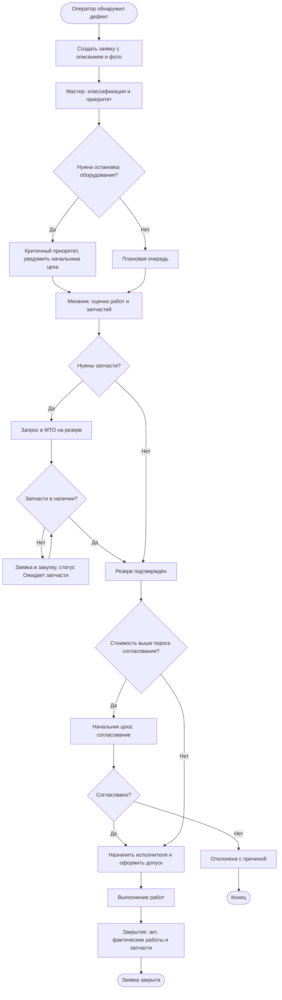
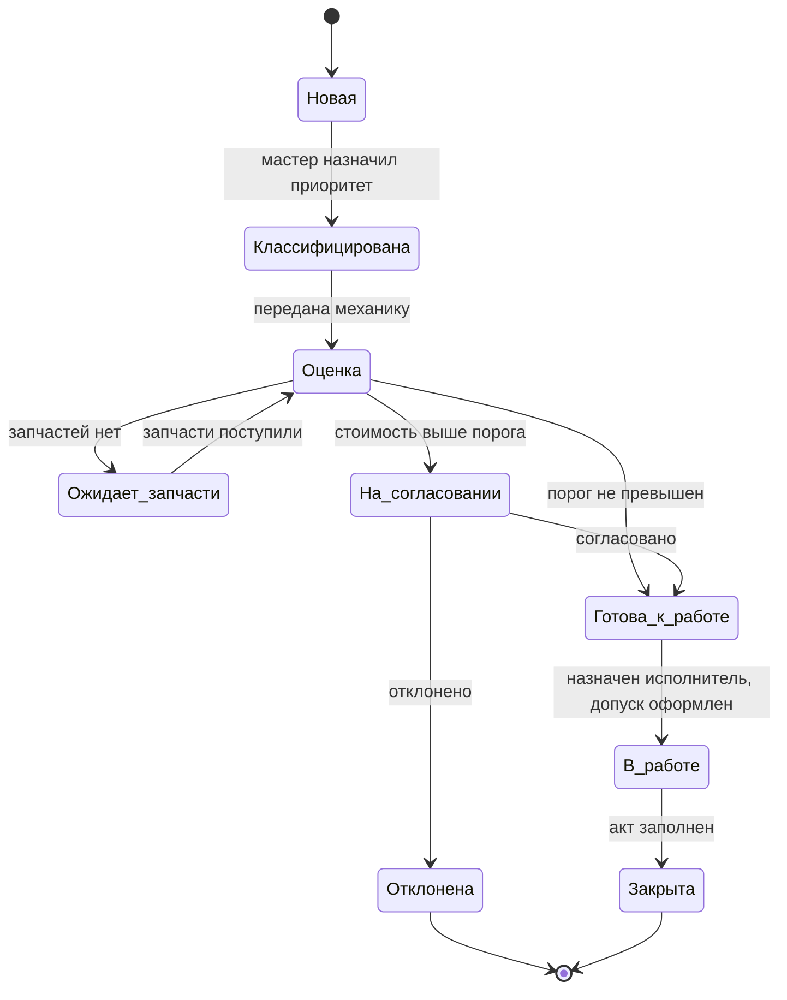
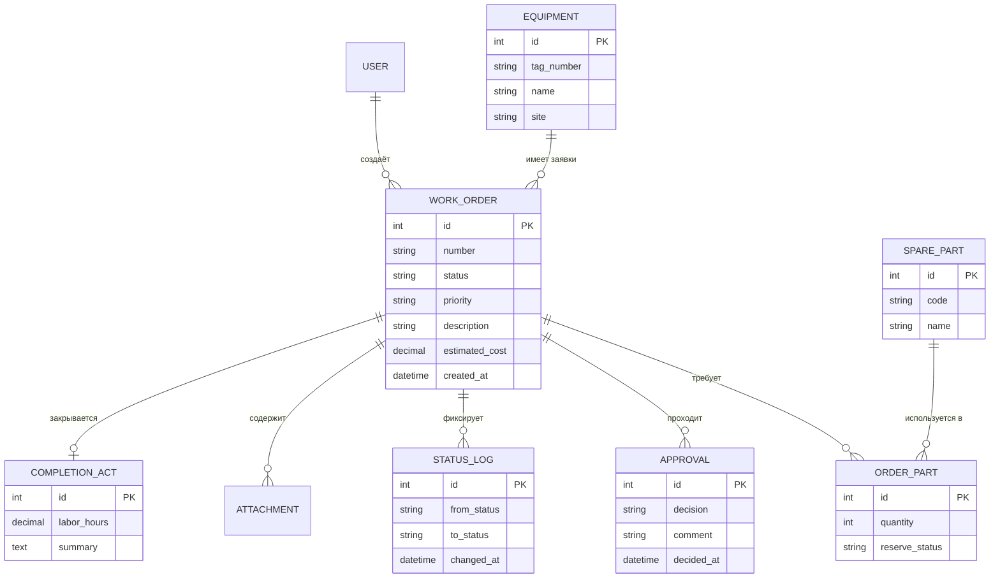

# Кейс 2. Система заявок на ТОиР нефтегазового промысла

> **Учебный, гипотетический кейс.** Организация, цифры, пороги и интеграции придуманы автором для тренировки. Это не описание реальной компании и не реальный опыт работы в отрасли. Используются типовые для отрасли понятия: ТОиР, наряд-допуск, МТО.

**Цель кейса:** показать полный путь системного аналитика от проблемы бизнеса до тестовых сценариев.

---

## 1. Контекст и проблема

Условная добывающая компания ведёт заявки на ремонт оборудования на промысле через бумажные журналы, мессенджеры и таблицы. Дефект фиксируется неформально, статус ремонта неизвестен, запчасти заказываются с задержкой, а отчёт по простоям собирается вручную.

**Проблемы (AS-IS)**

- Заявка теряется между оператором, мастером и механиком.
- Нет единого статуса: непонятно, кто сейчас отвечает за заявку.
- Потребность в запчастях выясняется поздно, оборудование простаивает.
- Согласование дорогих ремонтов идёт устно, нет следа решения.
- Данные для отчётов по простоям собирают вручную.

**Бизнес-цель (TO-BE):** сократить время от фиксации дефекта до начала ремонта и получить прозрачную историю заявок. Целевые показатели — **учебные примеры**, не измеренные данные: сокращение времени реакции на 30%, доля заявок с полным журналом решений 100%.

## 2. Стейкхолдеры

| Роль | Интерес | Влияние |
|---|---|---|
| Оператор установки | Быстро сообщить о дефекте | Среднее |
| Мастер участка | Классифицировать и приоритизировать заявки | Высокое |
| Механик / энергетик | Оценить объём работ и потребность в запчастях | Высокое |
| Начальник цеха | Согласовать дорогие ремонты, видеть простои | Высокое |
| Кладовщик / МТО | Резервировать и выдавать запчасти | Среднее |
| Специалист по охране труда | Контроль допуска к опасным работам | Высокое |
| ИТ и ИБ | Интеграции, доступы, аудит | Среднее |

## 3. Процесс TO-BE

Процесс показан flowchart в стиле BPMN. Экспорт в нотацию `.bpmn` — в [ROADMAP](../../ROADMAP.md).



## 4. Бизнес-требования

| ID | Требование |
|---|---|
| BR-1 | Любой дефект фиксируется в единой системе с историей решений |
| BR-2 | Заявка проходит маршрут с чёткой ответственностью на каждом шаге |
| BR-3 | Дорогие ремонты согласуются до начала работ |
| BR-4 | Потребность в запчастях выявляется до назначения исполнителя |
| BR-5 | Руководство получает отчёт по простоям и срокам без ручной сборки |

## 5. Функциональные требования

| ID | Требование | Трассировка |
|---|---|---|
| FR-1 | Оператор создаёт заявку: оборудование из справочника, описание, критичность, до 5 фото | BR-1 |
| FR-2 | Мастер назначает приоритет и категорию дефекта | BR-2 |
| FR-3 | Для критичных заявок система уведомляет начальника цеха | BR-2 |
| FR-4 | Механик заполняет оценку работ и список требуемых запчастей | BR-4 |
| FR-5 | Система формирует запрос на резерв запчастей в МТО и принимает ответ | BR-4 |
| FR-6 | Если стоимость оценки выше порога, заявка уходит на согласование начальнику цеха | BR-3 |
| FR-7 | Согласующий принимает решение «согласовать / отклонить»; при отклонении причина обязательна | BR-3 |
| FR-8 | Назначение исполнителя и фиксация допуска к работам | BR-2 |
| FR-9 | Закрытие заявки с актом: фактические работы, использованные запчасти, время | BR-1 |
| FR-10 | Каждое изменение статуса и решение хранится в неизменяемом журнале | BR-1 |
| FR-11 | Отчёт по заявкам и простоям за период с фильтрами по цеху, оборудованию, приоритету | BR-5 |
| FR-12 | Справочники оборудования и запчастей загружаются из внешней системы | BR-4 |

## 6. Нефункциональные требования

| ID | Категория | Требование (значения учебные) |
|---|---|---|
| NFR-1 | Доступность | Система работает в режиме 24/7, плановое окно обслуживания не более 4 часов в месяц |
| NFR-2 | Производительность | Создание заявки отвечает не дольше 2 секунд при 200 одновременных пользователях |
| NFR-3 | Надёжность | При отсутствии связи с площадки заявка сохраняется локально и отправляется при восстановлении канала |
| NFR-4 | Безопасность | Ролевая модель доступа, аудит всех действий, срок хранения журнала не менее 5 лет |
| NFR-5 | Интеграции | Обмен с ERP/МТО через REST; недоступность МТО не блокирует создание заявок |
| NFR-6 | Удобство | Создание заявки с телефона за не более чем 5 экранов, интерфейс пригоден для работы в перчатках (крупные элементы) |
| NFR-7 | Совместимость | Работа в браузерах на устройствах, принятых в компании (список уточнить) |

Почему NFR-3 важен: промысловые площадки часто имеют нестабильную связь, поэтому офлайн-режим создания заявки — критичное требование, которое легко упустить, если анализировать только офисный сценарий.

## 7. Роли и права

| Действие | Оператор | Мастер | Механик | Нач. цеха | МТО |
|---|:-:|:-:|:-:|:-:|:-:|
| Создать заявку | да | да | да | да | нет |
| Назначить приоритет | нет | да | нет | да | нет |
| Заполнить оценку и запчасти | нет | нет | да | нет | нет |
| Подтвердить резерв | нет | нет | нет | нет | да |
| Согласовать / отклонить | нет | нет | нет | да | нет |
| Закрыть заявку | нет | да | да | да | нет |
| Смотреть отчёты | нет | свой участок | свой участок | весь цех | склад |

## 8. User stories и acceptance criteria

### US-1. Создание заявки оператором

*Как оператор, я хочу быстро создать заявку на неисправность, чтобы мастер сразу увидел проблему.*

- **Given** я выбрал оборудование из справочника и ввёл описание, **When** я отправляю заявку, **Then** создаётся заявка со статусом «Новая», мне показывается её номер.
- **Given** описание пустое, **When** я отправляю заявку, **Then** система показывает ошибку и не создаёт заявку.
- **Given** нет связи, **When** я отправляю заявку, **Then** она сохраняется локально, а при появлении связи отправляется автоматически (NFR-3).
- **Given** я выбрал критичность «Остановка оборудования», **When** заявка создана, **Then** начальник цеха получает уведомление.

### US-2. Согласование дорогого ремонта

*Как начальник цеха, я хочу согласовывать ремонты выше порога, чтобы контролировать затраты.*

- **Given** оценка механика превышает порог, **When** механик завершает оценку, **Then** заявка переходит в статус «На согласовании» и появляется в моей очереди.
- **Given** я отклоняю заявку, **When** я не ввёл причину, **Then** система не принимает решение.
- **Given** я согласовал заявку, **When** решение сохранено, **Then** в журнал записаны автор, время и комментарий.

### US-3. Резерв запчастей

*Как механик, я хочу видеть наличие запчастей до начала работ, чтобы не останавливать ремонт на середине.*

- **Given** я добавил запчасти в оценку, **When** я отправляю запрос в МТО, **Then** по каждой позиции показывается результат: «в наличии», «нет в наличии», «ожидание ответа».
- **Given** МТО недоступно, **When** я отправляю запрос, **Then** заявка остаётся доступной для работы, а запрос повторяется автоматически (NFR-5).

### US-4. Закрытие заявки

*Как мастер, я хочу закрыть заявку с актом, чтобы фиксировать фактические работы.*

- **Given** работы выполнены, **When** я заполнил фактические работы и запчасти, **Then** заявка переходит в «Закрыта» и становится недоступной для редактирования.
- **Given** не заполнено время работ, **When** я пытаюсь закрыть заявку, **Then** система запрещает закрытие.

## 9. Жизненный цикл заявки



## 10. Модель данных



## 11. Интеграции

| Система | Направление | Что передаётся | Режим | При сбое |
|---|---|---|---|---|
| ERP / МТО | Двусторонняя | Справочник запчастей; запрос резерва; ответ с остатком | REST, запрос-ответ + периодическая синхронизация справочника | Заявка не блокируется, запрос резерва повторяется с нарастающей паузой |
| Справочник оборудования | Входящая | Технологические номера, названия, участки | Пакетная загрузка раз в сутки | Работаем по последнему загруженному справочнику, оповещаем ИТ |
| Почта / мессенджер | Исходящая | Уведомления о критичных и согласуемых заявках | Асинхронно | Повторная отправка, ошибки пишутся в журнал |

## 12. Фрагмент API

### `POST /api/v1/work-orders`

**Запрос**

```json
{
  "equipment_id": 1042,
  "description": "Повышенная вибрация насоса Н-3",
  "criticality": "stop",
  "photos": ["upload-8f2a", "upload-8f2b"]
}
```

**Ответ `201 Created`**

```json
{
  "id": 5871,
  "number": "WO-2026-005871",
  "status": "new",
  "created_at": "2026-10-02T06:15:00Z"
}
```

**Ошибки**

| Код | Причина | Пример тела |
|---|---|---|
| 400 | Пустое описание, неизвестная критичность | `{"error":"validation_error","fields":{"description":"required"}}` |
| 401 | Нет токена | `{"error":"unauthorized"}` |
| 403 | Нет права создавать заявки | `{"error":"forbidden"}` |
| 404 | Оборудование не найдено | `{"error":"equipment_not_found"}` |
| 409 | Дубликат: уже есть активная заявка с тем же оборудованием и описанием | `{"error":"duplicate_open_order","existing_id":5860}` |

### `POST /api/v1/work-orders/{id}/approval`

```json
{ "decision": "reject", "comment": "Перенести на плановый ремонт" }
```

Ответ `200 OK` с новым статусом. Если `decision = reject` и `comment` пуст, возвращается `400`.

## 13. Тест-кейсы

| ID | Покрывает | Шаги | Ожидаемый результат |
|---|---|---|---|
| TC-1 | FR-1 | Создать заявку с корректными данными | Статус «Новая», номер присвоен |
| TC-2 | FR-1 | Создать заявку без описания | Ошибка валидации, заявка не создана |
| TC-3 | NFR-3 | Отключить сеть, создать заявку, включить сеть | Заявка отправлена автоматически после восстановления |
| TC-4 | FR-3 | Создать заявку критичности «остановка» | Начальник цеха получил уведомление |
| TC-5 | FR-6 | Оценка выше порога | Статус «На согласовании» |
| TC-6 | FR-6 | Оценка ниже порога | Статус «Готова к работе», согласование пропущено |
| TC-7 | FR-7 | Отклонить заявку без комментария | Решение не принято, ошибка |
| TC-8 | FR-5, NFR-5 | Недоступна система МТО при запросе резерва | Заявка доступна, запрос повторяется |
| TC-9 | FR-9 | Закрыть заявку без часов работ | Закрытие запрещено |
| TC-10 | FR-10 | Пройти заявку до закрытия | Журнал содержит все переходы с автором и временем |
| TC-11 | Права | Оператор пытается согласовать заявку | 403 |
| TC-12 | API | Создать дубль активной заявки | 409 с `existing_id` |

## 14. Риски

| Риск | Вероятность | Влияние | Мера |
|---|---|---|---|
| Низкая связь на площадках | Высокая | Высокое | Офлайн-режим, очередь отправки (NFR-3) |
| Сопротивление пользователей смене привычного журнала | Средняя | Высокое | Простая форма создания, обучение, пилот на одном участке |
| Некачественные справочники оборудования | Средняя | Среднее | Валидация загрузки, ответственный за справочник |
| Недоступность ERP/МТО | Средняя | Среднее | Асинхронный запрос с повтором (NFR-5) |
| Неверно выбранный порог согласования | Средняя | Среднее | Порог настраивается, не зашит в код |

## 15. Допущения и открытые вопросы

1. Значение порога согласования стоимости и кто может его менять — не определено.
2. Как связаны заявки с процедурой наряд-допуска: хранить допуск в системе или только ссылку на внешний документ?
3. Кто отвечает за актуальность справочника оборудования?
4. Нужна ли интеграция с системой учёта простоев или отчёт строится внутри системы?
5. Требования к регуляторным срокам хранения документов уточнить у службы ИБ и нормативных документов компании.
6. Нужны ли многоязычные интерфейсы и поддержка устройств во взрывозащищённом исполнении — уточнить.

## 16. Что я бы сделал дальше

- Провести интервью с мастером и механиком и сравнить AS-IS в кейсе с реальным.
- Нарисовать прототип экранов оператора для мобильного устройства.
- Подготовить OpenAPI-спецификацию и согласовать формат ошибок с разработкой.
- Расписать контракт интеграции с МТО подробно: идемпотентность запроса резерва, повторы, тайм-ауты.
