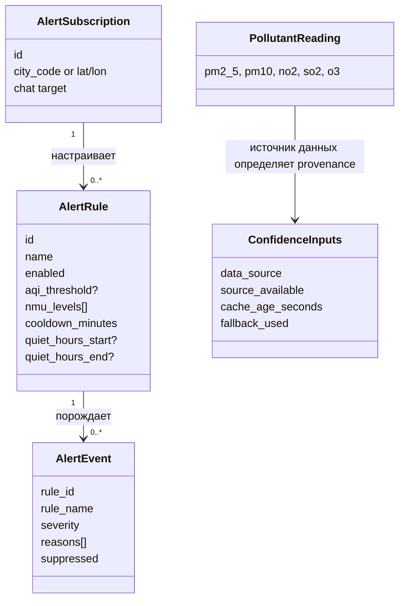
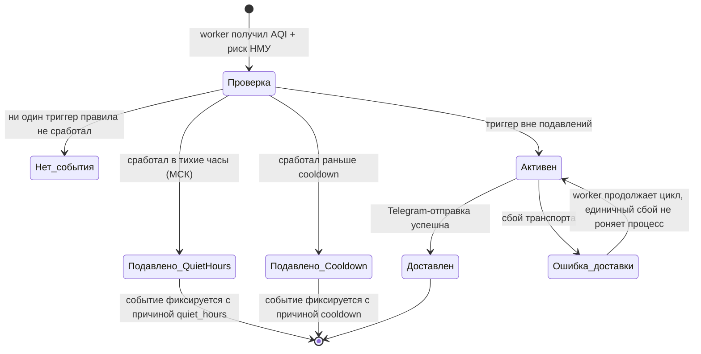

# Кейс AirTrace v2: телеметрия, алертинг и эксплуатация (полный цикл)

**Тип:** реальный production-проект автора — разработчик и аналитик в одном лице
**Репозиторий проекта:** [f1sherFM/AirTrace-v2](https://github.com/f1sherFM/AirTrace-v2) — код, тесты, CI, ADR и прод-активы открыты
**Прод:** [nande.webhop.me](https://nande.webhop.me) · API docs: [/docs](https://nande.webhop.me/docs) · Health: [/api/v2/health](https://nande.webhop.me/api/v2/health)

**Что показывает кейс.** Системный анализ не как «документация ради документации», а как инженерная практика: требования формализованы в коде и тестах, архитектурные решения зафиксированы в ADR, нефункциональные требования живут как SLO с порогами алертов и incident-Runbook'ами. Это редкая для начинающего связка: **требование → решение → код → автотест → прод-мониторинг**.

> **О проекте.** AirTrace v2 — система мониторинга качества воздуха: приём телеметрии загрязнителей, расчёт AQI и риска НМУ (неблагоприятных метеоусловий), оценка достоверности данных, правила алертинга с подавлением дублей, доставка в Telegram, публичный readonly API и SSR-веб. Стек: Python 3.13, FastAPI, PostgreSQL 16 (+TimescaleDB), Redis, Docker, GitHub Actions, Sentry.

---

## 1. Контекст и проблема

Пользователи получают данные о загрязнении воздуха из внешних источников, которые **нестабильны**: источник может быть недоступен, отдавать устаревший кэш или требовать отката на fallback-данные. Наивная реализация алертинга в таких условиях порождает два класса ошибок:

1. **Ложная тревога / ложное доверие.** Данные «протухли» или пришли из fallback — но система выдаёт их с тем же весом, что живые, и алертит по ним.
2. **Шквал уведомлений.** Один постоянно превышенный порог при каждой проверке присылает новое сообщение; ночью пользователь получает десятки одинаковых алертов.

**Бизнес-цель:** давать числовые показатели качества воздуха вместе с явной оценкой их достоверности, а алерты — только значимые, без дублей и с уважением к тишине пользователя.

**Границы системы**

| В границах | Вне границ |
|---|---|
| Readonly API v2: текущие данные, прогноз, история, тренды, health | Мобильные приложения (клиенты потребляют API) |
| Домен: AQI, риск НМУ, confidence, агрегация загрязнителей | Сбор телеметрии с физических датчиков (источники внешние) |
| Правила алертов, подписки, фоновый worker оценки | Собственный SMTP/пуш-транспорт: канал доставки — Telegram |
| SSR-веб: города, история, тренды, сравнение, настройки алертов | Долговременная BI-аналитика |
| Прод-контур: Docker, Postgres+Redis, Sentry, CI, runbook | Управление инфраструктурой провайдера внешних данных |

## 2. Архитектура и ключевые решения (ADR)

Модульный монолит с явными слоями; направление зависимостей — внутрь, к домену:

```text
api/v1/            legacy-адаптер совместимости
api/v2/            стабильный публичный API
application/       use cases, queries, сервисы (правила алертов, worker), SSR-слой
domain/            чистая логика: aqi, nmu, confidence, pollutants
infrastructure/    БД, репозитории, кэш, провайдеры, rate limiting
core/              app factory, lifecycle, settings
web/               Python SSR, шаблоны, статика
docs/              roadmap, ADR, ops/deployment-документация
tests/             regression, contract, SSR, migration-гейты
```

Решения зафиксированы как ADR (`docs/adr/`) — это аналитический артефакт «почему именно так», а не только «как»:

| ADR | Решение | Аналитический смысл |
|---|---|---|
| 001 | Модульный монолит | отказ от микросервисов ради скорости и целостности транзакций на текущем масштабе |
| 002 | Выделенный application-слой | сценарии использования отделены от транспорта и от доменной логики |
| 003 | TimescaleDB для истории | требование «долгая история измерений» выбрало хранилище, а не наоборот |
| 004 | Readonly-API-first | сначала стабилизируем контракт чтения, затем открываем запись |
| 007 | Политика декации v1 | обратная совместимость для существующих клиентов — отдельное управляемое требование |
| 008 | Provenance and confidence model | «насколько верить данным» — первоклассное поле ответа, а не примечание |
| 009 | Alert write-paths после стабилизации readonly v2 | управление риском: не плодить churn схемы и контракта |

**Пример трассировки решения:** ADR-009 («не открывать запись алертов, пока readonly v2 нестабилен») напрямую следует из NFR-совместимости: контракт `openapi/airtrace-v2.openapi.json` защищён контрактными тестами `test_v2_contract.py` и снапшот-тестом — изменение формы ответа до стабилизации сломало бы публичный контракт.

## 3. Бизнес-требования

| ID | Требование | Реализация |
|---|---|---|
| BP-1 | Показатель качества должен сопровождаться оценкой достоверности | `domain/confidence/calculator.py`: базовый балл по источнику + штрафы |
| BP-2 | Алерт должен учитывать не только факт превышения, но и режим НМУ | `domain/nmu/detector.py`, триггер `nmu_levels` в правиле |
| BP-3 | Пользователь не тонет в дублях и получает тишину ночью | cooldown + quiet hours в `alert_rule_engine.py` |
| BP-4 | Повторный запрос создания подписки не создаёт дубль | `Idempotency-Key` заголовок в `POST /v2/alerts` |
| BP-5 | Чужие вызовы записей невозможны, перегрузка невозможна | API-ключ на `/v2/alerts*`, раздельные rate-limit политики |

## 4. Функциональные требования (с кодом и тестами)

| ID | Требование | Код | Тест |
|---|---|---|---|
| FR-1 | Отдавать текущие данные, прогноз, историю, тренды, health по стабильному контракту | `api/v2/` (+ `docs/public_api_v2.md`) | `test_v2_contract.py`, `test_contract_snapshot.py` |
| FR-2 | Рассчитывать confidence: live 0.90 / historical 0.86 / forecast 0.74 / fallback 0.50, штраф −0.15 за недоступность источника, −0.22 за fallback, штраф за возраст кэша до −0.30 (за 6 ч) | `domain/confidence/calculator.py` | `test_property_confidence_scoring.py` |
| FR-3 | Определять риск НМУ по весам загрязнителей и погоде; «чёрное небо» → critical | `domain/nmu/detector.py` | `test_property_nmu_warning_generation.py`, `test_property_aqi_calculation.py` |
| FR-4 | CRUD правил алертов; правило обязано иметь хотя бы один триггер (`aqi_threshold` или `nmu_levels`) | `application/services/alert_rule_engine.py` | `test_alert_rule_validation_requires_trigger`, `..._rejects_invalid_nmu` |
| FR-5 | Подавлять повтор внутри cooldown и помечать причину `cooldown` | там же | `test_alert_rule_triggers_and_cooldown_suppresses_duplicates`, `test_alert_rule_cooldown_marks_suppressed_reason` |
| FR-6 | Quiet hours считать по московскому времени (в т.ч. интервал через полночь) | `_is_in_quiet_hours` + `MOSCOW_TZ` | `test_alert_rule_respects_quiet_hours`, `test_alert_rule_quiet_hours_use_moscow_time` |
| FR-7 | Классифицировать severity: AQI≥200 или НМУ critical → CRITICAL; AQI≥150 или high → WARNING; иначе INFO | `_severity()` | покрыто тестами движка |
| FR-8 | Фоновый worker: группировать подписки по локациям (один fetch на группу), оценивать AQI+НМУ, доставлять не-подавленные алерты, не падать на единичных сбоях fetch/delivery, корректно останавливаться | `application/services/alert_worker.py` | `test_stage4_alert_worker_*` (4 теста) |
| FR-9 | Доставка алертов в Telegram только с авторизацией | telegram-эндпоинты + `require_alert_delivery_auth` | `test_alert_telegram_api.py` (5 тестов) |
| FR-10 | Rate limiting с отдельными политиками на чтение и запись алертов, единый плоский контракт ошибки | `infrastructure/rate_limiting/` | `test_stage4_alert_rate_limits.py` |

## 5. Нефункциональные требования (живут как SLO и мониторинг)

NFR здесь — не декларация в таблице, а работающий контроль (`docs/slo_runtime_control.md`, `docs/incident_runbooks.md`):

| Категория | Значение | Где контролируется |
|---|---|---|
| Доступность API | 99.5% / мес., error budget 0.5% | burn-rate алерты: fast >14× за 5м, slow >2× за 1ч |
| Latency | p95 < 800 мс, p99 < 1500 мс | Prometheus-правила на `request_duration_seconds` |
| Ошибки 5xx | < 1.0% rolling 5m | warning >0.01, critical >0.03 |
| Деградация внешних источников | success rate ≥ 90%, cache hit ≥ 40% | отдельные алерты-предупреждения |
| Безопасность записи | все `/v2/alerts*` требуют API-ключ | `X-API-Key` / `Authorization: Bearer` |
| Наблюдаемость | Sentry + health-пробы + Grafana dashboard | `docs/health_probes.md`, прод-профиль Docker |
| Совместимость | контракт v2 зафиксирован OpenAPI + снапшот-тестом | `openapi/airtrace-v2.openapi.json` |

## 6. Модель предметной области



Ключевые бизнес-правила encoded прямо в домене (чистые функции, без I/O): веса загрязнителей и множители «чёрного неба» в `NMUDetector`, карта баллов источника в `ConfidenceCalculator`.

## 7. Жизненный цикл сигнала алерта



Два проектных решения, видимых из кода: **подавленное событие не выбрасывается, а возвращается с причиной** (`reasons + ["cooldown"]`, `suppressed=True`) — это даёт наблюдаемость «почему пользователь молчит»; и **оценка ведётся по часам Москвы**, хотя всё остальное хранится в UTC — исключение явно протестировано.

## 8. Фрагмент API-контракта: `POST /v2/alerts`

Создание подписки с идемпотентностью (реализация: `api/v2/alerts.py`).

**Запрос**

```http
POST /v2/alerts HTTP/1.1
Content-Type: application/json
X-API-Key: <alerts-key>
Idempotency-Key: 7c9e6679-7425-40de-944b-e07fc1f90ae7

{ "city_code": "msk", "lat": 55.7558, "lon": 37.6176 }
```

**Ответы (контракт ошибок объявлен явно):**

| Код | Когда | Что происходит |
|---|---|---|
| 201 | успех | создана подписка, применены v2-заголовки ответа |
| 401 | нет/неверный API-ключ | доступ к записи запрещён |
| 409 | конфликт `Idempotency-Key` | ValueError сервиса замапан на 409 |
| 422 | невалидное тело / иное нарушение инварианта правила | стандартная ошибка валидации |
| 429 | превышен лимит политики записи | отдельная read/write квота |
| 500 / 503 | внутренняя ошибка / деградация зависимости | контракт остаётся плоским |

Картирование ошибок — маленькое, но показательное решение: `ValueError("Idempotency-Key ...")` сервиса превращается в **409 Conflict**, остальные — в **422**; семантика конфликта повторной операции выведена из текста исключения на уровне transport-адаптера (`_map_service_error`).

## 9. Acceptance criteria (Given/When/Then, подтверждены тестами)

**AC-1 (FR-5, cooldown).** Given правило с `cooldown_minutes=30` только что сработало, When через 10 минут AQI снова выше порога, Then событие возвращается `suppressed=True` с причиной `cooldown`, новая доставка отсутствует.
→ `test_alert_rule_triggers_and_cooldown_suppresses_duplicates`

**AC-2 (FR-6, тихие часы).** Given правило с quiet hours 22:00–07:00 МСК, When событие оценивается в 23:00 МСК (в UTC уже следующие сутки), Then `suppressed=True` с причиной `quiet_hours`; проверка использует московский, а не серверный часовой пояс.
→ `test_alert_rule_quiet_hours_use_moscow_time`

**AC-3 (FR-4, инвариант правила).** Given обновление правила убирает оба возможных триггера, When вызов `update_rule`, Then `ValueError("At least one trigger is required")` — правило без источника сигнала невозможно.
→ `test_alert_rule_validation_requires_trigger`

**AC-4 (FR-8, устойчивость worker).** Given подписки на несколько городов, When один fetch и одна доставка падают, Then остальные группы обрабатываются, цикл завершается с фиксацией `failed_fetches`/`failed_deliveries`, процесс не прерывается.
→ `test_stage4_alert_worker_continues_after_fetch_and_delivery_failures`

**AC-5 (BP-4, идемпотентность).** Given повторный `POST /v2/alerts` с тем же `Idempotency-Key`, When конфликт, Then ответ 409, дубликат подписки не создан.
→ `test_stage4_v2_alerts_api.py`

**AC-6 (FR-10, раздельные квоты).** Given исчерпан бюджет чтения алертов, When клиент продолжает писать в пределах write-политики, Then чтение получает 429, запись — нет (и наоборот); форма ошибки остаётся единой.
→ `test_stage4_alert_rate_limits_use_separate_read_and_write_policies`

## 10. Интеграции

| Контрагент | Протокол/механизм | Обработка отказов |
|---|---|---|
| Внешние источники качества воздуха | HTTP-провайдеры, circuit breaker и деградация ресурсов (`infrastructure/resources/resource_circuit_breaker.py`, `resource_manager.py`) | fallback-режим + penalty в confidence; alert на success rate < 90% |
| Redis | кэш ответов, состояние rate limiter | деградация на in-memory limiter (см. тесты: `_redis_enabled=False`); alert на cache hit < 40% |
| PostgreSQL/TimescaleDB | хранение истории, подписок | readiness-проба сигнализирует о недоступности зависимости |
| Telegram Bot API | доставка алертов | ошибка доставки не роняет worker; счётчик `failed_deliveries` |
| Sentry | сбор исключений прода | tie-in к runbook по SEV-уровням |

## 11. Эксплуатация: SLO → алерты → Runbook

Замкнутый цикл «требование → контроль»: каждый NFR из раздела 5 имеет метрику, порог и реакцию.

- **SEV-1** — полный outage API или риск порчи данных; **SEV-2** — частичная деградация (провайдер/кэш/latency); **SEV-3** — мелкая деградация с workaround (`docs/incident_runbooks.md`).
- On-call чеклист первых 10 минут: подтвердить влияние через `/health`, `/metrics`, веб; назначить Incident Commander; заморозить несущественные деплои; завести таймлайн в UTC.
- Rollback описан как runbook-процедура, а не как надежда на удачу.

Это тот слой, который обычно отсутствует в портфолио аналитика-джуна — потому что его нельзя выдумать, его можно только пройти на проде.

## 12. Открытые вопросы и ограничения (честно)

| # | Вопрос | Статус |
|---|---|---|
| 1 | Форма payload алертов и внешний контракт нотификаций | осознанно отложены ADR-009 как Deferred Items |
| 2 | Хранение правил алертов | `AlertRuleEngine` исторически in-memory; persistence подписок — через репозитории (`sqlalchemy_alerts.py`); унификация — зона развития |
| 3 | SLA на доставку Telegram | не нормирован: сбои считаются, но retry-политика не специфицирована |
| 4 | Термин «НМУ» для внешних потребителей API | решается через числовые поля + причины-строки в ответах |

## 13. Чему научил этот кейс

- **Доменные константы важнее формулировок.** Пороги AQI (150/200), баллы источников (0.90/0.86/0.74/0.50), «чёрное небо» — не произвольные числа, а предметные константы, которые аналитик обязан выписать и обосновать; в этом проекте они стоят в коде как единственные места правды.
- **«Почему подавлено» — полноценное требование.** Возврат suppressed-событий с причиной вместо тихого дропа оказался одновременно продуктовым и операционным требованием.
- **NFR без метрики — пожелание.** Таблица SLO с порогами и burn-rate политикой превращает «высокую доступность» в ежедневный контроль.
- **Идемпотентность и часовые пояса ловятся тестами, а не ревью.** Два самых неочевидных баг-класса (дубль POST-подписки, quiet hours не по локальному времени) закреплены автотестами.

## 14. Трассировка «документ → код → тест»

| Артефакт кейса | Файлы проекта |
|---|---|
| Архитектурные решения | `docs/adr/001…009` |
| Публичный контракт API | `openapi/airtrace-v2.openapi.json`, `docs/public_api_v2.md` |
| FR-1 (readonly API) | `api/v2/`, `application/queries/v2_readonly.py` |
| FR-2 confidence | `domain/confidence/calculator.py` |
| FR-3 НМУ | `domain/nmu/detector.py`, `domain/aqi/calculator.py` |
| FR-4…FR-7 правила алертов | `application/services/alert_rule_engine.py` ↔ `tests/test_alert_rule_engine.py` |
| FR-8 worker | `application/services/alert_worker.py` ↔ `tests/test_stage4_alert_worker.py` |
| FR-9 Telegram | `tests/test_alert_telegram_api.py` |
| FR-10 rate limiting | `infrastructure/rate_limiting/` ↔ `tests/test_stage4_alert_rate_limits.py` |
| Идемпотентность подписок | `api/v2/alerts.py` ↔ `tests/test_stage4_v2_alerts_api.py` |
| NFR/SLO | `docs/slo_runtime_control.md`, `docs/health_probes.md`, `docs/load_soak_testing.md` |
| Эксплуатация | `docs/incident_runbooks.md`, `docs/vps_deployment_runbook.md`, GitHub Actions CI |
